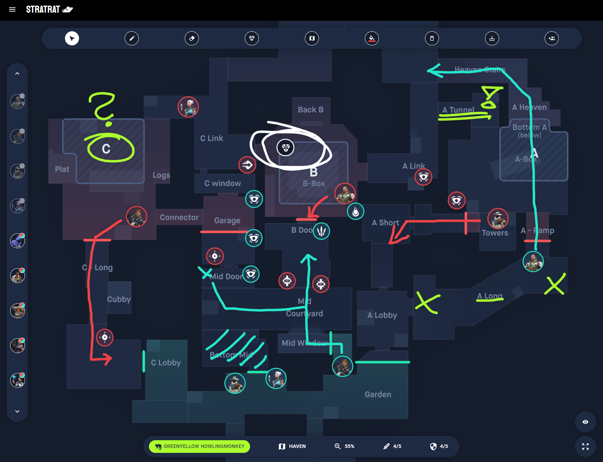

## Ctrl + C and Ctrl + V 

As software developers, we would often evaluate our code through different criterias and attributes such as how clean the code is or how expressive it is. However, the most important concern we often ignore is the fact that the code should be easy to change, especially later. Having code be flexible is such a staple as what you code today could be irrelevant tomorrow. Design patterns are a big part of coding as they are commonly used today. A design pattern is a general repeatable solution for a commonly occuring problem in software design. It is a description or template for how to solve a problem that can be used in many different situations. With design patterns, a person can speed up the development process by providing tested, proven development paradigms. Being able to reuse a design pattern can help to prevent subtle issues that can cause major problems later on. Additionally, it can improve code readability for coders that are familiar with the pattern.  

Design patterns are like the strategies you have to use in Valorant. Although you might not succeed in winning the round the first time, you can employ similar strategies almost every round after that in hopes that you will win a round.  By using a strategy pattern, you can gain advantages over your opponents to win every round and eventually, winning the game. Just like the same way you employ strategies to win games, you also employ design patterns in real-life programming to help with your general common problem. 

## My Experience

Just like using strategies and tools in video games, everyone uses design patterns in real life without realizing it. For example, when using sites like Github or Stack Overflow, there might be working code that might solutions to similar issues that you could be having. Using this can be more time efficient as other users just like me have gone through similar problems to figure out how to solve them. Rather than spending all of your time, trying to solve it and be stuck, you can use design patterns to help solve your problems. From my experience, when I am doing projects or homeworks, some problems I run into tend to be similar problems I ran into before. With that, I tend to use and follow my own solutions to solve these recurring problems. Using design patterns can help establish solutions to common problems as well as help with attributes such as keeping code maintainable.
